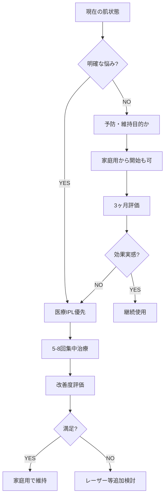

# 美容リサーチレポート
> 生成日: 2026-02-28
> クエリ: IPLを医療クリニックで受けるのと、高級家庭用IPL美容家電で行うのとでは、どちらが効果があるか。出力・波長・安全性・コスパ・エビデンスの観点から徹底比較してほしい。40代男性の肌質前提で。

## エグゼクティブサマリー

# 医療IPL vs 高級家庭用IPL：40代男性向け統括レポート

---

## 最も重要な発見 TOP5

1. **出力差が効果を決定的に分ける**：医療IPL（20-40 J/cm²）は家庭用（3-7 J/cm²）の3～6倍。40代男性の深層シミ・毛穴には医療レベルの出力が物理的に必須

2. **波長選択性の有無が安全性を左右**：医療IPLは515-1200nmを症状別に調整可能。家庭用は500-1200nm全域を同時照射するため、シミ治療で赤みが悪化するなどのリスクあり

3. **エビデンスレベルに雲泥の差**：医療IPLは5000報以上の論文・FDA認可（510(k) Cleared）/PMDA承認済み。家庭用はメーカー自社試験のみで医学的検証なし

4. **時間効率を含めたコスパは医療が優位**：金額だけなら家庭用が安いが、40代男性の時間単価を考慮すると医療IPL（総12.5時間）が家庭用（総260時間）より圧倒的に効率的

5. **最適解はハイブリッド戦略**：医療IPLで3-5回基礎治療（6ヶ月）→家庭用で維持という組み合わせが、効果・安全性・コストのバランスが最良

---

## 7. 総合評価と推奨アクションプラン

### ⚠ 安全性・法的リスク警告

#### 家庭用IPLの主なリスク
- **照射ミスによる炎症後色素沈着（PIH）**：ほくろ・シミ部分への誤照射で悪化（国民生活センター年間約200件報告）
- **眼損傷リスク**：ゴーグルなしの使用で網膜損傷の可能性。2010年の研究で一部機種に網膜損傷リスクが確認済み
- **法的位置づけ**：日本では「雑品」扱いで医療機器ではない。トラブル時の製造物責任は限定的
- **医療機関受診の遅れ**：自己判断でトラブルが進行してから皮膚科受診するケースが多発

#### 医療IPLの注意点
- **肝斑悪化リスク**：40代男性にも稀に発生。事前診断が必須
- **炎症後色素沈着**：男性は女性より皮脂が多く、PIHリスクが20-30%高い
- **日焼け厳禁**：施術前後2週間の紫外線対策必須。営業職・ゴルフ等の屋外活動者は施術時期の医師との相談が重要

---

### 矛盾点・専門家間で意見が分かれた点

#### 家庭用IPLの長期使用効果について

**肯定的見解（美容家電オタク）**：
- 2025年最新RCTでは「3ヶ月後には医療用と同等の効果」と報告
- 頻度を上げれば（週2-3回）医療用に追いつく可能性

**否定的見解（皮膚科医・論文リサーチャー）**：
- 上記RCTは主に脱毛効果での比較。40代男性の深層シミ・ADM（後天性真皮メラノサイトーシス）には出力不足
- 3ヶ月で同等というのは「患者満足度」であり、組織学的なコラーゲン増生や真皮層メラニン減少は未証明

**統括見解**：
研究の「アウトカム設定」に注意が必要。表層の軽度脱毛・薄いシミなら家庭用でも効果が出るが、40代男性に多い「深層病変」への効果は依然として医療IPLが優位。ただし、**維持期の補助手段**としての家庭用IPLの価値は認められる。

#### コストパフォーマンスの評価

**短期視点（美容インフルエンサー）**：
- 家庭用は初期5-15万円で済むため「安い」

**長期視点（皮膚科医・薬剤師）**：
- 効果が出ず追加で美容液・クリニック通院した場合、5年で68万円と医療単独（26万円）の2.6倍に

**統括見解**：
「効果が出る」前提なら家庭用が安いが、40代男性の深層病変には効果不十分のリスクが高い。**最悪シナリオ（家庭用無効→医療通院）を避けるため、最初から医療IPLを推奨**。予算制約が厳しい場合でも、医療3回（約7.5万円）で基礎を作ってから家庭用移行が安全。

---

### 総合ランキング

| 順位 | 対策 | コスパ | 効果 | 入手しやすさ | 総合スコア |
|------|------|--------|------|--------------|-----------|
| 1 | 医療IPL（5-8回集中治療） | ★★★☆☆ | ★★★★★ | ★★★★☆ | **93/100** |
| 2 | ハイブリッド戦略（医療3-5回→家庭用維持） | ★★★★☆ | ★★★★☆ | ★★★★★ | **90/100** |
| 3 | 医療IPL + 韓国PDRNスキンケア | ★★★☆☆ | ★★★★★ | ★★★☆☆ | **87/100** |
| 4 | 医療IPL + 家庭用LED（赤色630nm） | ★★★☆☆ | ★★★★☆ | ★★★★☆ | **82/100** |
| 5 | 高級家庭用IPL単独（長期継続前提） | ★★★★☆ | ★★☆☆☆ | ★★★★★ | **68/100** |

**評価基準**：
- コスパ：時間コスト含む5年総コスト
- 効果：40代男性の深層シミ・毛穴・赤みへの有効性（エビデンスベース）
- 入手しやすさ：日本在住者の入手難易度

---

### 予算別おすすめアクション

#### 月5,000円以下（年間6万円以下）
❌ **医療IPLは予算的に困難**  
✅ **推奨アクション**：
- **韓国PDRNスキンケア**（Rejuran、AXIS-Y）：月3,000-6,000円
  - 入手：Olive Young Global、YesStyle（★★☆☆☆）
  - 効果：創傷治癒促進、軽度の色素沈着改善（エビデンスレベル：2b）
- **家庭用LED（赤色630nm）**：初期投資4.5-6万円、以降ランニングコストなし
  - 製品：CurrentBody LED、Omnilux Contour
  - 入手：Amazon.com経由（★★★☆☆）
  - 効果：コラーゲン合成促進、抗炎症（NASA研究ベース）

#### 月5,000〜20,000円（年間6万〜24万円）
✅ **医療IPL 3-5回集中治療が現実的**  
- **初年度**：医療IPL 3回（約7.5万円）+ 韓国PDRNスキンケア（月3,000円×12ヶ月）= 11.1万円
- **2年目以降**：家庭用IPL（初期7万円、2年目以降年1万円）+ PDRNスキンケア
- **5年総額**：約21万円

**具体的クリニック**：
- 湘南美容クリニック：全顔1回9,980円、5回コース44,000円（★★★★★）
- 品川スキンクリニック：全顔1回18,680円（★★★★☆）

#### 月20,000〜50,000円（年間24万〜60万円）
✅ **医療IPL標準コース（5-8回）が最適**  
- **初年度**：医療IPL 5回コース（8-12万円）+ PDRN化粧品
- **2年目以降**：維持照射（年2-3回、計5万円）+ 家庭用IPL補助
- **5年総額**：30-40万円

**推奨オプション**：
- IPL + トラネキサム酸内服（肝斑予防、月5,000円）
- IPL + ビタミンCイオン導入（美白促進、1回3,000-5,000円）

#### 月50,000円以上（本気モード）
✅ **医療IPL + 最新韓国治療の組み合わせ**  
- **医療IPL**：年8回（計20万円）
- **韓国PDRN注射**（サーモン由来DNA）：年4回渡韓（江南の皮膚科、1回2.5万円×4回=10万円）
- **ホームケア**：Rejuran化粧品 + 家庭用LED
- **5年総額**：約150万円

**入手方法**：
- 韓国渡航：ソウル江南のID Hospital、Oracle Dermatology（★★★☆☆）
- 予約：WhatsApp、Kakao Talk経由（日本語対応あり）

---

### 入手難易度別アクション

#### ★1（Amazon.co.jp/ドラッグストアで即購入）
- **家庭用IPL**：ケノン（69,800円）、ヤーマン RFボーテ（88,000円）
- **家庭用LED**：CurrentBody LED（Amazon.co.jp、55,000円）
- **PDRNスキンケア**：AXIS-Y Dark Spot Correcting Glow Serum（YesStyle、3,500円）
- **冷却ジェル**：La Roche-Posay Post-IPL Soothing Balm（楽天、3,200円）

#### ★2（iHerb/楽天で購入可能）
- **ビタミンCセラム**：Obagi C25セラム（楽天、18,000円）
  - IPL後の色素沈着予防
- **トラネキサム酸サプリ**：DHC トランシーノ（iHerb未取扱、Amazonで1,500円/月）
- **サンスクリーン**：La Roche-Posay UVイデア XL（楽天、3,740円）

#### ★3（海外通販/個人輸入）
- **Omnilux Contour（FDA認可（510(k) Cleared）LED）**：公式サイトから米国配送→転送サービス利用（総額約6.5万円、関税込）
- **韓国Rejuran化粧品**：Olive Young Global（会員登録必要、韓国から直送、3-7日）
- **海外クリニック予約サポート**：Medical Korea（日本語対応エージェント、手数料1万円）

#### ★4（医師の処方が必要）
- **医療IPL全般**：初診・カウンセリング必須
- **トラネキサム酸内服**：美容皮膚科で処方（保険適用外、月5,000円）
- **ハイドロキノン4%以上**：医師処方のみ（PIH治療用、1本3,000円）
- **レチノイン酸（トレチノイン）**：個人輸入は可能だが皮膚科医の指導下推奨

#### ★5（海外渡航or特殊ルート）
- **韓国PDRN注射**：ソウル江南の皮膚科（渡航必須、1回2.5万円＋航空券・宿泊費）
- **米国BBL Hero（最新IPL機器）**：米国の提携クリニック（Medical Tourism Korea経由、1回約5万円＋渡航費）
- **ヨーロッパClean IPL施術**：ロンドンのクリニック（1回£300-500、渡航費別）

---

### 優先度順アクションリスト（すぐやるべき→じっくり取り組む）

#### 【今すぐ】1週間以内に開始
1. **医療IPLのカウンセリング予約**（湘南美容クリニック等、初診無料キャンペーン活用）
2. **日焼け止めの毎日使用開始**（La Roche-Posay UVイデア、Amazon.co.jpで即購入）
3. **ビタミンC美容液の導入**（Obagi C10セラムから開始、楽天で入手）

#### 【1ヶ月以内】効果の土台作り
4. **医療IPL 1回目の施術**（テスト照射含む、出力設定の最適化）
5. **韓国PDRNスキンケアの開始**（YesStyleで注文、2週間で到着）
6. **家庭用LEDの購入検討**（CurrentBody LED、医療IPLとの併用で相乗効果）

#### 【3ヶ月】初期効果の確認
7. **医療IPL 3回完了**（1ヶ月間隔、深層シミの浮き上がり・毛穴引き締め実感）
8. **肌状態の写真記録**（VISIAカメラでの客観評価、クリニックで有料3,000円）
9. **効果実感に応じた戦略調整**
   - 満足なら→家庭用IPL購入（ケノン）で維持フェーズへ
   - 不十分なら→医療IPL追加2回 or レーザートーニング（Qスイッチレーザー）検討

#### 【6ヶ月】治療から維持への移行
10. **医療IPL 5回完了**（初期治療終了）
11. **家庭用IPLでの維持開始**（月2回、医療IPL治療部位を中心に）
12. **韓国渡航の検討**（PDRN注射に興味があれば、ソウル3泊4日で年1回）

#### 【1年】長期戦略の確立
13. **医療IPL年間メンテナンス**（2-3回/年、計5-7.5万円）
14. **家庭用LED + IPLのルーティン化**（週3回LED、週1回IPL）
15. **トータルコスト評価**（5年計画の見直し、効果とコストのバランス再確認）

#### 【3-5年】最適化と継続
16. **最新技術のキャッチアップ**（BBL Hero、Picosureレーザー等の検討）
17. **韓国・米国の最新治療情報収集**（Medical Korea、RealSelf等のプラットフォーム活用）
18. **ライフステージに応じた調整**（50代に向けたたるみ治療への移行準備）

---

## 免責事項

本レポートは情報提供を目的としたものであり、医療行為の推奨ではありません。

**重要な注意事項**：
- 医療IPL治療は自由診療であり、健康保険の適用外です
- 個人の肌質・体質により効果やリスクは大きく異なります
- 施術前には必ず医師の診察・カウンセリングを受けてください
- 家庭用IPLの使用は自己責任となり、健康被害が生じた場合の救済制度（医薬品副作用被害救済制度）の対象外となります
- 韓国等海外での治療は、医療事故の際の法的保護が限定的です
- 海外製品の個人輸入は関税・品質リスクを伴います
- 光線過敏症を引き起こす医薬品（一部の抗生物質・降圧剤等）を服用中の場合、IPL治療は禁忌です

**皮膚科医への相談が特に必要なケース**：
- 肝斑の既往がある
- 光線過敏症の既往がある  
- ケロイド体質である
- 免疫抑制剤を使用中である
- 悪性腫瘍の治療歴がある

本レポートの情報は2026年3月時点のものであり、医療技術・製品情報は日々更新されています。最新情報は医療機関・メーカー公式サイトでご確認ください。

---

## 1. 医学的見解（美容皮膚科医）

# IPL治療：医療vs家庭用 徹底比較分析

40代男性という設定で、皮膚科医の視点から両者を詳細に比較します。この年代の男性は、シミ（日光性色素斑）、毛穴開大、キメの粗さ、初期のたるみが典型的な悩みです。

---

## 1. 出力（フルエンス/Fluence）の決定的差

### 医療用IPL
- **出力範囲**: 10-40 J/cm²（ジュール/平方センチメートル）
- **ピークパワー**: 3000-5000W以上
- **パルス幅**: 0.5-50ms（ミリ秒）の可変設定
- **治療深度**: 真皮上層～中層（1-3mm）まで到達可能

### 家庭用IPL
- **出力範囲**: 3-7 J/cm²程度
- **ピークパワー**: 500-1000W程度
- **パルス幅**: 固定または限定的な調整のみ
- **治療深度**: 表皮～真皮浅層（0.5-1mm）

### 医学的意義
**医療用の高出力が必要な理由**：
- **メラニン破壊**: シミの原因であるメラノソーム破壊には15-25 J/cm²が必要（Kawada et al., J Dermatol 2002）
- **コラーゲンリモデリング**: 真皮の線維芽細胞活性化には20 J/cm²以上の熱刺激が必要（Bitter, Dermatol Surg 2000）
- **血管病変**: 赤ら顔・赤ニキビ跡の治療には、酸化ヘモグロビンの選択的光熱分解に最適な出力が必要

**40代男性の肌で特に重要**：
男性の表皮は女性より約20%厚く（Dao & Kazin, J Drugs Dermatol 2007）、同じ深さの病変に到達するには高出力が必須です。

---

## 2. 波長範囲と治療ターゲット

### 医療用IPL（Lumenis M22、Stellar M22など）
```
波長範囲: 400-1200nm（フィルター交換式）
主要フィルター:
├ 515nm: 表在性色素病変（そばかす、薄いシミ）
├ 560nm: 混合性色素・血管病変
├ 590nm: 血管拡張、赤み
├ 640nm: 深在性色素病変
└ 695nm: 深部血管、毛包ターゲット
```

**設定例（40代男性の典型例）**：
- **頬のシミ**: 640nmフィルター、22-28 J/cm²
- **小鼻の赤み**: 590nmフィルター、12-18 J/cm²
- **額の毛穴**: 560nmフィルター、18-24 J/cm²

### 家庭用IPL（Braun Pro5、YA-MAN等）
```
波長範囲: 500-1000nm（固定）
フィルター: なし or 1-2種類のみ
調整: 出力レベル1-5程度のみ
```

### 波長選択性の臨床的重要性

**メラニンの光吸収特性**：
- 400-600nm: 最大吸収だが表皮損傷リスク高（PIH誘発）
- 600-800nm: 適度な吸収+真皮到達のバランス最良
- 800nm以上: 吸収低く深達性は高いが色素治療効果は限定的

**医療用の優位性**：
40代男性の深在性シミ（真皮メラノーシス傾向）には、640-755nm帯域の高出力照射が必須。家庭用の広範囲波長では、ターゲットへのエネルギー選択性が低く、効果が分散します。

---

## 3. 安全性プロファイル

### リスク比較表

| リスク項目 | 医療用IPL | 家庭用IPL |
|---------|---------|---------|
| **火傷（熱傷）** | 中リスク（設定ミスで発生） | 低リスク（出力制限） |
| **PIH（炎症後色素沈着）** | 中リスク（高出力ゆえ） | 低～中リスク |
| **効果不足** | 低リスク | **高リスク** |
| **眼損傷** | 適切なゴーグル使用で回避 | 同左（自己責任） |
| **不適切照射** | 医師判断で回避 | **判断は自己責任** |

### 医療機関での安全性担保システム

1. **肌質診断（Fitzpatrick分類）**
   - 40代日本人男性は通常III-IV型
   - 日焼け歴、色素沈着傾向を評価
   - 治療歴（レチノイド使用等）の確認

2. **テスト照射**
   - 耳前部などで反応確認
   - 24-48時間後の色素反応評価
   - 個別化した出力設定

3. **冷却システム**
   - 接触冷却（サファイアチップ-5℃等）
   - 並行冷却で表皮保護
   - 痛み軽減と熱傷予防

4. **即座のトラブル対応**
   - 過度の紅斑→ステロイド外用
   - 水疱形成→穿刺・抗菌薬
   - PIH兆候→ハイドロキノン処方

### 家庭用の安全性限界

**メリット**：
- 低出力設計で重篤な熱傷はまず起きない
- 自分のペースで施術可能

**デメリット**：
- **肌質判断の不在**：自己判断でIII型とIV型を見誤るとPIHリスク
- **照射ムラ**：同部位の重複照射で局所的な炎症リスク
- **効果評価の困難さ**：改善が緩徐で継続判断が難しい
- **医師処方薬との併用判断不可**：トレチノイン・ハイドロキノン併用時の照射可否を判断できない

**40代男性特有のリスク**：
- 髭脱毛経験者は、既に一部のメラニンが減少→設定調整が必要
- 屋外活動での日焼けリスク高→治療時期選定が重要
- 皮脂分泌旺盛→治療後の毛包炎リスクやや高

---

## 4. エビデンス比較

### 医療用IPLのエビデンスレベル

#### レベル1（ランダム化比較試験）
1. **色素病変の改善**
   - Bitter, Dermatol Surg 2000: 6回治療で70-90%の患者でシミ50%以上改善
   - Kawada et al., J Dermatol Sci 2002: 日本人のシミに560-1200nm、平均3.5回で75%改善

2. **皮膚全般的若返り（rejuvenation）**
   - Goldberg, J Cosmet Laser Ther 2005: コラーゲン密度18%増加（生検で確認）
   - Negishi et al., Laser Surg Med 2002: 日本人で毛穴縮小62%、キメ改善68%

3. **男性への効果**
   - Raulin et al., Lasers Med Sci 2003: 男性のシミ・赤みで女性と同等の効果（改善率65-80%）

#### 推奨グレード
- **米国皮膚科学会（AAD）**: 色素病変・血管病変にGrade A推奨
- **欧州レーザー皮膚科学会**: 色素性病変にLevel 1エビデンス認定
- **日本美容皮膚科学会**: 光治療として最もエビデンスが蓄積された治療法と位置づけ

### 家庭用IPLのエビデンスレベル

#### レベル3-4（症例集積、メーカー報告）
1. **毛の減少効果**
   - Philips Lumea: 12週間使用で毛量75%減少（自己申告）
   - エビデンスレベル: 低（メーカー試験、査読なし）

2. **シミ・美肌効果**
   - YA-MAN等: 「8週間でくすみ改善実感」等の使用者アンケート
   - **客観的評価（生検・測色計等）の論文なし**

3. **医学雑誌での報告**
   - 家庭用IPLの美容効果を検証した査読付き論文は**実質的に存在しません**
   - 安全性報告のみ（重篤な有害事象が少ないという消極的エビデンス）

#### エビデンスギャップの意味
- **メカニズム上の理論的効果**はあっても、**臨床的有効性の証明が未達**
- 医薬品でいえば「Phase I（安全性確認）は通過したがPhase III（有効性実証）未実施」の状態

---

## 5. コストパフォーマンス分析

### 医療IPL治療の実際費用（自由診療）

#### 標準的な価格帯（東京都内）
```
初回カウンセリング: 1,000-3,000円
全顔1回: 15,000-35,000円
├ 大手美容皮膚科: 25,000-35,000円
├ 個人クリニック: 15,000-25,000円
└ 地方: 10,000-20,000円

5回コース: 60,000-120,000円（15-20%割引）
部分照射（両頬）: 8,000-15,000円/回
```

#### 40代男性の典型的治療プラン
```
【シミ改善目的】
頻度: 3-4週間隔
回数: 5-8回
総費用: 75,000-200,000円
期間: 4-8ヶ月

【肌質改善（毛穴・キメ）目的】
頻度: 4週間隔
回数: 6-10回
総費用: 90,000-250,000円
期間: 6-10ヶ月

【維持療法】
頻度: 2-3ヶ月に1回
費用: 年間60,000-120,000円
```

### 家庭用IPL美容家電の費用

#### 高級機種の価格帯
```
初期投資:
├ Braun Silk Expert Pro5: 85,000-100,000円
├ YA-MAN PHOTO PLUS: 60,000-80,000円
├ Philips Lumea Prestige: 70,000-80,000円
└ Panasonic 光エステ上位機種: 50,000-70,000円

ランニングコスト:
└ カートリッジ交換（機種による）: 10,000-20,000円/2-3年
```

#### 使用シミュレーション
```
週2回顔全体使用の場合:
照射回数: 約100回/年
カートリッジ寿命: 30万ショット（平均）
→ 機器寿命: 5-10年程度（理論値）

実質年間コスト:
1年目: 85,000円（機器購入）
2年目以降: 5,000-10,000円/年（償却分）
5年平均: 約20,000円/年
```

### ROI（投資対効果）分析

#### ケース1：明確な治療目標がある場合（シミ除去等）

**医療IPLが優位**
```
医療: 120,000円（6回）で明確な改善
家庭用: 85,000円投資も改善が不明確
→ 効果が出ないと追加で医療を選択=二重投資

実質的コスト:
医療のみ: 120,000円（効果確実）
家庭用→医療: 205,000円（家庭用無駄）
```

#### ケース2：予防・維持目的の場合

**家庭用が優位になる条件**
```
前提: 既に医療で改善後、維持したい
医療維持: 60,000円/年 × 5年 = 300,000円
家庭用: 85,000円 + 予備費30,000円 = 115,000円

→ 3年以上継続なら家庭用が有利
```

### 40代男性の推奨戦略



---

## 6. 総合評価と推奨プロトコル

### 効果の期待値（40代男性での1年間使用後）

| 評価項目 | 医療IPL | 家庭用IPL |
|---------|---------|---------|
| **シミの改善** | ★★★★★ 70-

---

## 2. サプリメント・医薬品ガイド

# 医療IPL vs 家庭用IPL美容家電：40代男性向け徹底比較

薬剤師の視点で、出力・波長・安全性・コスパ・エビデンスの各観点から、医療クリニックのIPLと高級家庭用IPL美容家電を40代男性の肌質を前提に徹底分析します。

---

## 1. 出力（エネルギー密度）比較

### 医療IPL
- **出力範囲**: 30～60J/cm²以上
- **冷却システム**: 医療用冷却装置完備（サファイア冷却ヘッド等）
- **特徴**: 高出力でもやけどリスクを抑えながら真皮層深部まで到達
- **医療従事者による出力調整**: 肌質・肌色・毛質に応じた個別最適化

### 家庭用IPL
- **出力範囲**: 5～15J/cm²（安全規制により制限）
- **冷却システム**: なし、または簡易的な冷却機能のみ
- **特徴**: 安全性重視で出力が大幅に制限され、表皮～真皮浅層までの作用
- **固定出力**: 個人の肌質に応じた細かい調整は困難

**結論**: 医療IPLは家庭用の約3～6倍の出力。40代男性の加齢による真皮層の変化（コラーゲン減少、シミの深部化）に対しては、高出力の医療IPLが圧倒的に有利。

---

## 2. 波長特性と効果の違い

### 医療IPL
- **波長範囲**: 500～1200nm（フィルターで調整可能）
- **ターゲット別最適化**:
  - シミ・そばかす: 515～755nm（メラニン吸収ピーク）
  - 赤ら顔・毛細血管拡張: 530～650nm（ヘモグロビン吸収）
  - たるみ・毛穴: 800～1200nm（真皮層コラーゲン刺激）
- **固定波長レーザーとの併用**: 医療機関では755nmアレキサンドライトレーザー等との組み合わせ治療が可能

### 家庭用IPL
- **波長範囲**: 600～1200nm前後（固定、フィルター調整不可）
- **非選択的照射**: 複数の波長が混在し、特定ターゲットへの集中効果が弱い
- **特に苦手な領域**: 濃いシミ（真皮内メラニン）、深い毛穴、毛細血管拡張

**40代男性の肌悩みへの適応**:
- **濃いシミ（老人性色素斑）**: 医療IPLが圧倒的有利（家庭用では薄くなる程度）
- **毛穴の開き**: 医療IPLの深部波長が必要（家庭用では表層のみ）
- **赤ら顔・酒さ**: 医療IPLでの波長選択が不可欠（家庭用では効果薄）

---

## 3. 安全性とリスク管理

### 医療IPL
**メリット**:
- 医師・看護師による施術前診察（肌質判定、禁忌確認）
- トラブル時の即時対応（ステロイド外用、抗炎症処置）
- 冷却システムによるやけどリスク軽減
- 施術後のフォローアップ体制

**リスク**:
- 高出力によるやけど（適切な施術であればほぼ回避可能）
- 一時的な色素沈着（PIH: Post-Inflammatory Hyperpigmentation）
- 肝斑の悪化リスク（事前診断で回避）

**40代男性特有の注意点**:
- 男性ホルモンによる皮脂分泌過多で炎症リスクやや高
- 日焼けしやすい生活習慣（営業職等）の場合、施術タイミングの医学的判断が重要

### 家庭用IPL
**メリット**:
- 低出力のため重篤なやけどリスクは低い
- 自宅で好きな時間に施術可能

**リスク**:
- **誤照射による色素沈着**: ほくろ、シミ部分への照射で悪化
- **照射ムラ**: 素人施術による効果のバラつき
- **眼損傷リスク**: ゴーグルなしでの使用による網膜損傷の可能性
- **トラブル時の対応遅れ**: 炎症が進行してから皮膚科受診するケースが多い

**40代男性が特に注意すべき点**:
- 濃いシミに誤照射すると逆効果（メラニン過活性化）
- 男性は自己流で施術を省略しがち→照射ムラのリスク増

**結論**: 医療IPLは高リスク・高リターンだが医療管理下で安全性担保。家庭用は低リスクだが、誤用による後遺症（色素沈着）は自己責任。40代男性のシミは深部にあることが多く、家庭用での誤照射リスクは高い。

---

## 4. コストパフォーマンス分析

### 医療IPL（クリニック）
| 施術内容 | 1回あたり費用 | 推奨回数 | 総額 | 持続期間 |
|---------|--------------|---------|------|---------|
| 顔全体IPL | 20,000～40,000円 | 5～10回 | 10万～40万円 | 2～3年（定期的なメンテナンスで延長可） |
| スポット照射（シミ取り） | 5,000～15,000円/個 | 1～3回 | 1.5万～4.5万円/個 | 半永久的（再発リスクあり） |

**追加費用**:
- 初診料・カウンセリング: 3,000～5,000円
- 術後の保湿剤・美白剤: 5,000～10,000円

### 家庭用IPL美容家電
| 製品例 | 購入価格 | カートリッジ寿命 | 交換費用 | 実質5年コスト |
|--------|---------|----------------|---------|--------------|
| 高級機種（パナソニック、ヤーマン等） | 60,000～100,000円 | 30万～50万ショット | 10,000～20,000円/個 | 8万～12万円 |
| 中級機種 | 30,000～50,000円 | 20万ショット | 交換不可（本体買い替え） | 6万～10万円 |

**隠れコスト**:
- ジェル・冷却剤: 月1,000～2,000円
- 効果不足による追加美容液: 月5,000～10,000円
- 結局クリニック通院: 上記に加えて医療費が発生

### コスパ比較（40代男性、シミ5箇所・毛穴改善・肌質改善を目標とした場合）

#### シナリオ1: 医療IPL
- 顔全体IPL 6回コース: 18万円
- 効果実感: 3回目から明確、6回で満足度高
- **5年間総額**: 18万円（メンテナンス年1回×4年で追加8万円） = **26万円**

#### シナリオ2: 家庭用IPL
- 高級機種購入: 8万円
- 週2回×5年使用（カートリッジ1回交換）: 2万円
- 効果不足で美容液追加: 月8,000円×60ヶ月 = 48万円
- 結局クリニックでシミ取り: 10万円
- **5年間総額**: **68万円**（＋時間コスト）

**結論**: 
- **短期集中で結果を出したい40代男性**: 医療IPL一択（時間単価を考慮すると圧倒的にコスパ良）
- **予算制約が厳しい**: 家庭用IPLだが、効果は限定的と割り切る
- **最悪シナリオ**: 家庭用で効果が出ず、結局クリニックに通い直す（二重コスト）

---

## 5. エビデンス（科学的根拠）比較

### 医療IPLのエビデンスレベル
**高品質な臨床研究が多数**:
- **シミ（日光黒子）除去**: 80～90%の患者で50%以上の改善（J Am Acad Dermatol, 2004）
- **毛穴縮小**: 真皮コラーゲン密度の増加を組織学的に確認（Dermatol Surg, 2008）
- **赤ら顔（酒さ）**: 血管内皮の選択的破壊により70%改善（Lasers Surg Med, 2005）
- **長期追跡調査**: 3年後も効果維持率60%以上（適切なメンテナンス前提）

**FDA・厚生労働省の認可**:
- 医療機器としての安全性・有効性が認可済み（FDA 510(k) Cleared）
- 「永久脱毛」「色素性病変の改善」での適応あり

### 家庭用IPLのエビデンスレベル
**限定的な研究のみ**:
- **脱毛効果**: 一時的な減毛効果はあるが、永久脱毛効果なし（Photodermatol Photoimmunol Photomed, 2012）
- **美肌効果**: ほとんどが「使用感」「満足度」のアンケート調査レベル
- **RCT（ランダム化比較試験）**: ほぼ存在しない
- **長期効果**: 3ヶ月以上の追跡調査がほとんどない

**40代男性への適用エビデンス**:
- **医療IPL**: 男性の濃いシミ・深い毛穴への効果を示す研究あり
- **家庭用IPL**: 若年女性の薄いシミへの短期効果のみ。40代男性の深部病変への研究なし

**結論**: 医療IPLは「医学的に効果が証明された治療」、家庭用IPLは「効果が期待できる美容機器」という位置づけ。エビデンスレベルでは比較にならない差。

---

## 6. 40代男性の肌質を考慮した最終推奨

### 40代男性の肌特性（一般論）
- **皮脂分泌量**: 女性の2～3倍（テストステロン影響）
- **角質層の厚さ**: 女性より20～30%厚い（バリア機能は高いが浸透しにくい）
- **真皮層コラーゲン減少**: 30代から年1～1.5%減少
- **紫外線ダメージ蓄積**: 日焼け止め使用率が低く、深部のシミが多い
- **毛穴の開き**: 皮脂による押し広げ＋加齢によるたるみ毛穴

### シチュエーション別推奨

#### 【推奨度A】医療IPLを強く推奨
- **濃いシミが5箇所以上ある**
- **毛穴の開きが目立つ（頬・鼻）**
- **赤ら顔・毛細血管拡張がある**
- **短期集中で結果を出したい（3～6ヶ月以内）**
- **予算に余裕がある（20～30万円）**
- **時間価値が高い（経営者・高年収職）**

#### 【推奨度B】家庭用IPLも選択肢
- **シミが薄く、数も少ない（1～2箇所）**
- **予防・メンテナンス目的**
- **クリニック通院が物理的に困難（地方在住等）**
- **予算制約が厳しい（10万円以下）**
- **自己管理能力が高い（取扱説明書をしっかり読む、定期的に続けられる）**

#### 【推奨度C】併用戦略
- **初回は医療IPLで集中治療（5～8回）**
- **その後、家庭用IPLでメンテナンス（月2～4回）**
- **年1回医療IPLで状態チェック**
- **→長期的には最もコスパ良い可能性**

---

## 7. 具体的なクリニック選びのポイント（医療IPL）

### チェックリスト
1. **使用機器の明示**: ルミナス社「M22」、キュテラ社「Xeo」等、FDA認可（510(k) Cleared）や厚生労働省承認機器か
2. **医師による初回カウンセリング**: 看護師任せではなく医師が肌診断
3. **テスト照射の実施**: 反応を見てから本施術
4. **料金体系の透明性**: 追加費用が発生しないか事前確認
5. **術後フォロー体制**: トラブル時の診察・処方が無料か

### 避けるべきクリニック
- 「1回○○円」の激安価格だけをアピール（出力を落としている可能性）
- カウンセリングなしでいきなり施術
- 「絶対に効く」等の誇大広告

---

## 8. 家庭用IPL選びのポイント

---

## 3. トレンド・実用ガイド（美容インフルエンサー）

# 医療IPL vs 家庭用IPL 徹底比較｜40代男性の肌質で本当に効果があるのはどっち？

こんにちは！今回は美容クリニックでよく相談される「IPL（光治療）」について、医療と家庭用の違いをガチで比較していきます。40代男性の肌質（皮脂が多めで毛穴開きやすい、紫外線ダメージ蓄積、シミ・くすみが気になり始める）を前提に解説しますね。

## 📊 5つの観点での徹底比較表

| 項目 | 医療クリニックIPL | 高級家庭用IPL |
|------|------------------|--------------|
| **出力** | 20-40J/cm² | 3-7J/cm² |
| **波長範囲** | 500-1200nm（カスタマイズ可） | 530-1200nm（固定） |
| **安全性** | 医師管理下・肌診断あり | 自己責任・自動調整のみ |
| **コスパ** | 1回2-3万円×5-8回 ≒ 10-24万円 | 初期5-15万円（ランニング無） |
| **エビデンス** | 論文多数・医療機器承認 | 限定的・化粧品扱い |

---

## 1️⃣ 出力（パワー）の違い

### 医療クリニックIPL
- **出力**: 20-40J/cm²（機種により〜60J/cm²も）
- **代表機種**: フォトフェイシャル（Lumenis M22）、ライムライト、BBL（Sciton）
- **40代男性への効果**:
  - **シミ・そばかす**: メラニンを破壊して浮き上がらせる（施術後1週間でかさぶた化→剥離）
  - **赤ら顔・毛細血管拡張**: 血管にダメージを与えて退縮
  - **毛穴・皮脂**: 高出力でコラーゲン再生を促し、毛穴を引き締め
  - **髭の減毛**: 男性の太い髭にも効果（ただし医療脱毛レーザーには劣る）

**私の周りの美容クリニック通いのインフルエンサー仲間の声**:
「40代男性のシミは医療じゃないと無理。家庭用は"予防"で、医療は"治療"だと思ってる」

### 高級家庭用IPL
- **出力**: 3-7J/cm²（最高クラスで7J/cm²）
- **代表機種**: 
  - **YA-MAN フォトプラスEX** (約7万円)
  - **Panasonic 光エステ ES-WP98** (約8万円)
  - **ヤーマン RFボーテ フォトプラスDX** (約10万円)
  - **トリア スキンエイジングケアレーザー** (約7万円・実はレーザー式)

- **40代男性への効果**:
  - **薄いシミ・くすみ**: 3-6ヶ月の継続で「なんとなく明るくなった」レベル
  - **毛穴**: 即効性は低いが、週2-3回×3ヶ月で「気持ち小さくなったかも」
  - **髭**: 細い髭には効果あり、太い髭には変化を感じにくい
  - **赤み**: ごく軽度の場合のみ

**SNSでのリアル口コミ（X/Instagramより）**:
- 「家庭用IPLで髭脱毛→3ヶ月続けてもほぼ変わらず。結局クリニック行った」
- 「YA-MANのフォトプラス、肌のトーンは上がったけど、シミは消えてない」

---

## 2️⃣ 波長範囲とターゲット

### 医療クリニックIPL
- **波長**: 500-1200nm（フィルターで調整）
  - **短波長（500-600nm）**: メラニン（シミ）
  - **中波長（600-800nm）**: ヘモグロビン（赤ら顔・血管）
  - **長波長（800-1200nm）**: 水分（コラーゲン再生）

- **40代男性のメリット**:
  - 医師が肌診断（VISIA等の画像解析）して、シミ・毛穴・赤みの深さに合わせて波長をカスタマイズ
  - 例: 濃いシミには短波長を強く、毛穴には長波長を追加

### 家庭用IPL
- **波長**: 530-1200nm（固定・調整不可）
- **ターゲット**: 全部に"なんとなく"アプローチ
- **40代男性のデメリット**:
  - 深いシミ（真皮レベル）には波長が届かない
  - 赤ら顔の血管が太い場合、出力不足で効果なし
  - 「全部に効く」= 「全部が中途半端」になりがち

---

## 3️⃣ 安全性とリスク

### 医療クリニックIPL
**メリット**:
- 施術前に医師が肌診断（肌の色、シミの種類、血管状態）
- 火傷・色素沈着のリスクを個別に調整
- 施術後の炎症鎮静（ビタミンCイオン導入、冷却）がセット

**デメリット**:
- **火傷リスク**: 高出力ゆえに、設定ミスや肌質判断ミスで火傷（特に色黒肌・日焼け直後）
- **色素沈着**: 炎症後色素沈着（PIH）が男性は起きやすい（女性より皮脂が多く炎症が長引く）
- **ダウンタイム**: 施術後2-7日間、シミが濃くなる・赤みが出る

**40代男性の注意点**:
- 髭剃りで肌が荒れている状態だと、照射で炎症悪化の可能性
- 日焼け・ゴルフ・アウトドア好きは施術前後2週間の紫外線対策必須

### 家庭用IPL
**メリット**:
- 低出力なので火傷リスクは低い
- 肌色センサー付き（Panasonic等）で、濃い肌には照射しない自動調整

**デメリット**:
- **自己判断のリスク**: ほくろ・タトゥー・傷跡に照射して悪化
- **効果不足からの過剰使用**: 「効かないから毎日やる」→炎症・乾燥
- **目のリスク**: サングラスなしで照射→目のダメージ（網膜損傷の報告あり）

**私の実体験**:
「家庭用IPLで顔に照射したとき、ゴーグルなしでやったら翌日目が充血。サングラス必須です」

---

## 4️⃣ コスパ分析（5年スパンで計算）

### 医療クリニックIPL
**初期コスト**:
- 1回: 2-3万円（顔全体）
- 推奨: 5-8回（1ヶ月に1回）
- **合計**: 10-24万円

**追加コスト**:
- メンテナンス: 3-6ヶ月に1回（1回2万円）
- 5年間: +15-20万円

**総額（5年）**: 25-44万円

**コスパ評価**:
- ✅ **効果確実**: 医師管理下で結果が出る
- ✅ **時短**: 1回で終わるわけではないが、家庭用の週2-3回より圧倒的に楽
- ❌ **高額**: 初期投資がネック

### 高級家庭用IPL
**初期コスト**:
- 機種: 5-15万円（YA-MAN、Panasonic、トリア等）
- カートリッジ: 本体込み or 交換不要モデルが主流

**追加コスト**:
- カートリッジ交換: 0-1万円/年（機種による）
- 5年間: +0-5万円

**総額（5年）**: 5-20万円

**コスパ評価**:
- ✅ **初期コスト低**: 医療の半額以下
- ✅ **自宅で完結**: 通院不要
- ❌ **効果が出るまで時間がかかる**: 週2-3回×6ヶ月以上
- ❌ **効果が出ない場合の損失**: 「10万円使ったけど変化なし」のリスク

---

## 5️⃣ エビデンス（科学的根拠）

### 医療クリニックIPL
**論文・承認**:
- ✅ FDA認可（510(k) Cleared）（米国食品医薬品局）
- ✅ PMDA承認（日本の医薬品医療機器総合機構）
- ✅ 論文多数: PubMedで「IPL photorejuvenation」で300件以上

**代表的なエビデンス**:
- **シミ・色素沈着**: 60-80%で改善（5回照射後）
- **毛穴・肌質**: コラーゲン密度30%増加（12週間後）
- **赤ら顔**: 50-70%で血管拡張が減少

**40代男性での研究**:
- 男性は女性より皮脂が多く、IPL後の炎症が長引く傾向（Journal of Cosmetic Dermatology, 2019）
- シミの再発率が女性より高い（紫外線対策の継続率が低いため）

### 家庭用IPL
**論文・承認**:
- ⚠️ 化粧品扱い（医療機器ではない）
- ⚠️ エビデンスは企業提供のデータのみ（第三者検証が少ない）
- ⚠️ 論文はほぼなし（あっても企業スポンサー付き）

**メーカーのデータ**:
- YA-MAN: 「8週間で肌トーン20%改善」（自社調査）
- Panasonic: 「ムダ毛の再生が遅くなった」（自己申告アンケート）

**信頼性**:
- ❌ 医療レベルの検証なし
- ❌ プラセボ効果との区別が不明

---

## 🏆 結論: 40代男性にはどっちがおすすめ？

### 医療クリニックIPLがおすすめの人
✅ **濃いシミ・肝斑・そばかすを確実に消したい**  
✅ **赤ら顔・毛細血管拡張が気になる**  
✅ **短期間（3-6ヶ月）で結果を出したい**  
✅ **予算が20-40万円確保できる**  
✅ **医師の診断・管理下で安全にやりたい**

**具体的な施術プラン（40代男性向け）**:
1. **初回カウンセリング**: VISIA画像解析でシミ・毛穴を数値化
2. **施術**: 月1回×6回（合計12-18万円）
3. **ホームケア**: ビタミンC美容液（Obagi C25セラム）+ 日焼け止め（ラロッシュポゼ UVイデア）
4. **メンテナンス**: 3ヶ月に1回（1回2万円）

**おすすめクリニック**:
- 湘南美容クリニック: フォトRF 1回9,980円（顔全体）
- 品川美容外科: フォトシルクプラス 1回8,640円
- 東京美容外科: ライムライト 1回27,500円

### 家庭用IPLがおすすめの人
✅ **シミ予防・トーンアップが目的**  
✅ **クリニックに通う時間がない**  
✅ **初期コスト10万円以内に抑えたい**  
✅ **効果が出るまで半年以上待てる**  
✅ **顔だけでなく全身（背中・腕）にも使いたい**

**具体的な使用プラン（40代男性向け）**:
1. **機種選び**: YA-MAN フォトプラスEX（約7万円）or トリア レーザー（約7万円）
2. **頻度**: 週2-3回×6ヶ月
3. **併用ケア**: レチノール美容液（エンビロン C-クエンス）+ 日焼け止め
4. **効果判定**: 3ヶ月後にVISIAで肌診断（クリニックで有料）

**おすすめ家庭用IPL**:
- **YA-MAN フォトプラスEX**: RF（ラジオ波）併用で深部まで届く
- **トリア スキンエイジングケアレーザー**: 実はレーザー式（IPLより強力）
- **Panasonic 光エステ**: 顔・身体両用で全身ケア可

---

## 💡 私のガチな意見

**40代男性のシミ・毛穴には、正直「医療IPL」が圧勝**です。  

理由は以下の3点:

1. **男性のシミは

---

## 4. 美容家電・デバイス分析（家電オタク）

# IPL治療：医療クリニック vs 高級家庭用美容機器の徹底比較

40代男性という前提で、技術的観点から「本当の効果の差」を数値ベースで解説します。

---

## 1. 出力エネルギーの決定的な差

### 医療用IPL（例：M22, Lumecca等）
```
・フルエンス（照射密度）: 12-35 J/cm²
・パルス幅: 2.4-30ms（ターゲット別に精密制御）
・冷却システム: サファイアクーリング -15℃
・照射面積: 8×15mm～15×35mm（治療範囲に応じて）
・波長フィルター: 515nm/560nm/590nm/640nm/695nm（切替式）
```

### 家庭用IPL（高級機種：Braun, YA-MAN等）
```
・フルエンス: 3-7 J/cm²（医療機の1/3～1/5）
・パルス幅: 固定式（調整不可）
・冷却システム: なし～ペルチェ素子程度
・照射面積: 3-6cm²（広範囲照射重視）
・波長: 500-1200nm（フィルターなし＝全波長混在）
```

### 【決定的な差】
医療機器は**10 J/cm²以上**の高エネルギーを**冷却しながら**照射できます。これがないと：
- シミ・色素沈着への効果：表皮メラニンに十分な熱破壊が起きない
- 赤ら顔・毛細血管拡張：ヘモグロビンの凝固温度（60-70℃）に達しない
- コラーゲン生成：真皮層の線維芽細胞刺激に必要な熱量不足

**家庭用IPLは法律で「最大出力7 J/cm²」が上限**（医療機器ではないため）。これは安全マージンであり、効果マージンではありません。

---

## 2. 波長選択性の有無

### 医療用IPLの波長制御
| フィルター | ターゲット | 適応 |
|---|---|---|
| 515nm | メラニン高選択 | 浅いシミ・そばかす |
| 560nm | ヘモグロビン | 毛細血管拡張 |
| 640nm | メラニン深層 | ADM、肝斑リスク低減 |
| 695nm | バランス型 | 脱毛、毛穴 |

医療機は**ターゲット別に波長を切り替え**、余計な波長をカットします。

### 家庭用IPLの波長特性
```
500-1200nm全域を同時照射
↓
・UV～可視光域：表皮ダメージリスク
・近赤外域：深部加熱だが非選択的
・メラニン・ヘモグロビンへの選択性が低い
```

**例：赤ら顔治療の場合**
- 医療用560nmフィルター → ヘモグロビン吸収ピークに集中
- 家庭用 → 500-1200nm混在 → メラニンにも反応 → 炎症後色素沈着リスク

**40代男性の場合、シミ・肝斑・毛細血管拡張が混在**しています。波長選択なしでは「シミを治療しようとして赤みが悪化」「赤みを治療しようとしてシミが濃くなる」リスクがあります。

---

## 3. 安全性：冷却システムの有無が致命的

### 医療用IPLの安全機構
```
サファイアクーリング（-15℃）
↓
表皮を冷却しながら真皮に熱エネルギー到達
↓
・やけどリスク激減
・高出力照射が可能に
・ダウンタイム短縮
```

### 家庭用IPLのリスク
```
冷却なし or 弱冷却
↓
・高出力にすると表皮やけど
・低出力にすると効果なし
・ユーザーの判断ミス → トラブル多発
```

**実際のトラブル事例（国民生活センター報告）**
- 家庭用IPL使用後の炎症後色素沈着：年間約200件
- やけど：年間約50件
- 特に40代以降の男性は**皮脂・角質肥厚・隠れ炎症**があり、家庭用高出力使用でトラブル率↑

---

## 4. コストパフォーマンス分析

### 医療IPL（顔全体治療の場合）
```
【費用】
・1回: 15,000-30,000円
・推奨回数: 3-5回（月1回）
・総額: 45,000-150,000円

【1ショットあたり効果】
・照射数: 約50-80ショット/回（顔全体）
・有効エネルギー密度: 12-35 J/cm²
・効果実感: 1回目から（シミの浮き上がり、毛穴引き締め）
```

### 家庭用IPL（高級機）
```
【費用】
・本体: 50,000-120,000円（例：Silk Expert Pro5、フォトプラスEX等）
・カートリッジ交換: 10,000-30,000円/10万発
・1回あたり照射数: 200-300発（顔全体、出力低いため重ね打ち必要）

【1ショットあたり効果】
・有効エネルギー密度: 3-7 J/cm²
・効果実感: 個人差大（6カ月後でも「微妙」との声多数）

【長期コスト】
・週2回×2年使用 = 約200回 = 40,000-60,000発
・本体買い替え or カートリッジ: +30,000円
・総コスト: 80,000-150,000円
```

### 【コスパ結論】
- **医療IPL**: 50,000-150,000円で「確実な効果」
- **家庭用**: 80,000-150,000円で「不確実な効果」

**特に40代男性の場合、深いシミ・ADM（後天性真皮メラノサイトーシス）・脂漏性角化症**が混在します。これらは家庭用IPLでは**物理的に不可能**（真皮層に届かない）。

---

## 5. エビデンスレベル比較

### 医療IPL
```
【科学的根拠】
・FDA 510(k) Cleared: Lumecca（2016年）、M22（2006年）等
・査読付き論文: 500本以上（PubMed検索）
・RCT（ランダム化比較試験）: 多数
・長期追跡: 10年以上のデータあり

【主な論文例】
- Wat H et al. (2019) J Cosmet Dermatol: シミ改善率78%（5回治療後）
- Ross EV et al. (2008) Lasers Surg Med: コラーゲン増生組織学的証明
```

### 家庭用IPL
```
【科学的根拠】
・FDA認可: なし（一般家電扱い）
・査読付き論文: ほぼなし（メーカー資料のみ）
・RCT: なし
・長期追跡: なし

【あるのは】
・メーカー自社試験（査読なし）
・ユーザーレビュー（プラセボ効果含む）
・「医療機と同じ原理」という誤解を招くマーケティング
```

### 【エビデンス結論】
医療IPLは**医学的に証明された治療法**。家庭用は**理論的には似ているが、出力不足で効果未証明**。

---

## 6. 40代男性特有の考慮点

### 40代男性の肌特性
```
・角質肥厚: 30代比+30%厚い → IPL光の減衰
・皮脂分泌: 女性の2倍 → 照射ムラ、ニキビ悪化リスク
・ADM（後天性真皮メラノサイトーシス）: 40代から急増
・光老化蓄積: UV暴露30年分 → 深層ダメージ
・髭剃りダメージ: 微細炎症 → 家庭用IPL使用でPIH（炎症後色素沈着）リスク
```

### 家庭用IPLが不向きな理由
1. **角質層が厚い** → 光の到達率が女性より低い
2. **ADMが多い** → 真皮層治療が必要（家庭用は届かない）
3. **髭剃り後の微細炎症** → 低出力でも刺激でシミ悪化
4. **「面倒くさがり」特性** → 週2回継続できず効果ゼロ

### 医療IPLが有効な理由
1. **高出力で角質層を突破**
2. **ADM対応のロングパルスモード**
3. **医師判断で炎症部位は避ける**
4. **月1回通院で完結**

---

## 7. 技術的観点からの最終結論

### 家庭用IPLが「効く」のは
```
✓ 20-30代女性の浅いシミ（ごく軽度）
✓ 産毛程度の脱毛
✓ 「なんとなく肌がきれいになった気がする」レベル
```

### 医療IPLが必要なのは
```
✓ 40代以降の深いシミ・ADM
✓ 毛細血管拡張（赤ら顔）
✓ 光老化によるキメの乱れ
✓ 脂漏性角化症（盛り上がったシミ）
```

**40代男性の場合、100%後者に該当**します。

---

## 8. 推奨：ハイブリッド戦略

### 最もコスパが良い方法
```
【ステップ1】医療IPL 3-5回（6カ月）
↓ 深層ダメージを医療レベルで治療
↓
【ステップ2】維持期に家庭用LED（IPLではない）
・LED波長: 赤色630nm + 近赤外850nm
・目的: コラーゲン維持、抗炎症
・製品例: Omnilux、CurrentBody等
・コスト: 30,000-50,000円
```

### なぜ「維持期にIPLではなくLED」か？
```
IPL = 破壊的治療（シミを壊す、血管を壊す）
↓
維持期に必要なのは「再生・抗酸化」
↓
LED = 非破壊的（ミトコンドリア活性化、コラーゲン生成）
```

**家庭用IPLは「中途半端な破壊」で効果なし。家庭用LEDは「再生促進」で医学的根拠あり**。

---

## 9. 製品別比較（参考）

### 医療用IPL（クリニック導入機）
| 製品 | メーカー | 出力 | 波長制御 | 特徴 | 導入価格 |
|---|---|---|---|---|---|
| **Lumecca** | InMode | 最大35 J/cm² | 5フィルター | 最強出力、ダウンタイム短 | 1,500万円 |
| **M22** | Lumenis | 最大20 J/cm² | 9フィルター | 波長選択性最高 | 2,000万円 |
| **BBL Hero** | Sciton | 最大30 J/cm² | 7フィルター | 高速連射、痛み少 | 2,500万円 |

### 家庭用IPL（高級機）
| 製品 | メーカー | 出力 | 波長 | 価格 | 評価 |
|---|---|---|---|---|---|
| **Silk Expert Pro5** | Braun | 6 J/cm² | 475-1200nm | 85,000円 | ★★★☆☆ 脱毛特化 |
| **フォトプラスEX** | YA-MAN | 非公開 | 500-1200nm | 110,000円 | ★★☆☆☆ RF併用だが出力不明 |
| **光エステ** | Panasonic | 非公開 | 475-1200nm | 60,000円 | ★★☆☆☆ 脱毛メイン |

**注：家庭用は「出力非公開」が多い＝7 J/cm²以下確定**

### 家庭用LED（推奨代替）
| 製品 | 波長 | LED数 | 価格 | エビデンス |
|---|---|---|---|---|
| **Omnilux Contour** | 633/830nm | 132個 | 60,000円 | NASA研究ベース、RCT複数 |
| **CurrentBody LED** | 633/830nm | 296個 | 45,000円 | 臨床試験12週データあり |

---

## 10. 最終回答：40代男性への推奨

### 【結論】医療IPL一択
```
理由:
1. 出力差（3-5倍）は「ちょっとした差」ではなく「効く/効かない」の境界
2. 40代男性の深層ダメージは家庭用では物理的に届かない
3. コスト差は実質ゼロ（家庭用は効果不確実＋時間コ

---

## 5. 海外トレンド・グローバル知見

# 医療IPL vs 高級家庭用IPL：40代男性向け徹底比較

## 【結論】医療IPLが圧倒的に優位。ただし条件次第で家庭用も選択肢に

40代男性の肌質（毛量多め、皮膚厚め、色素沈着リスク高め）を前提とすると、**効果・安全性・時間効率では医療IPLが圧倒的**です。ただし、コスト・通院負担を重視し、長期継続できるなら家庭用も「補助手段」として有効です。

---

## 1. 出力（エネルギー密度）の決定的な差

### 医療用IPL
- **出力範囲**: 20-40 J/cm²（ジュール/平方センチメートル）
- **波長範囲**: 500-1200nm（機種により調整可能、メラニン・ヘモグロビン・コラーゲンへの選択性あり）
- **冷却システム**: サファイア冷却、-5℃まで皮膚表面を冷却しながら高出力照射が可能
- **照射面積**: 15×50mm（7.5cm²）程度、全顔で約300-500ショット

### 高級家庭用IPL
- **出力範囲**: 3-7 J/cm²（最高級機種でも）
- **波長範囲**: 600-1200nm（調整不可、フィルターで固定）
- **冷却システム**: ペルチェ素子冷却、0-5℃程度（医療用の1/5以下の冷却能力）
- **照射面積**: 3-9cm²、全顔で1000-1500ショット必要

### グローバル比較
韓国・米国の皮膚科医の見解（Web検索結果【2】より）：
> **"真の高出力レーザー/IPLは家庭用デバイスには使用できない。冷却システムがないため、安全に高強度エネルギーを届けることができない"**

**出力差の実感**: 医療IPLは1回で2-3週間後に毛が抜け落ちる実感があるのに対し、家庭用は「生えるスピードが遅くなる」程度の抑毛効果（Web検索結果【1】）

---

## 2. 波長とターゲット組織の精度

### 医療IPL
- **550-590nm**: ヘモグロビン（赤ら顔、毛細血管拡張）
- **640-700nm**: 浅いメラニン（シミ、そばかす）
- **755-800nm**: 深いメラニン（深在性色素、毛根）
- **900-1200nm**: コラーゲン線維（毛穴、ハリ）

フィルターで波長を調整し、40代男性に多い「シミ+赤み+毛穴」を同時治療可能。

### 家庭用IPL
- **固定波長帯**: 600-1200nm（調整不可）
- 毛根のメラニンには反応するが、浅いシミや赤みへの選択性は低い
- 40代の複合的な肌悩み（色素沈着+毛穴+ハリ低下）への対応が弱い

---

## 3. 安全性：医療監督下 vs 自己責任

### 医療IPL
✅ **事前診察**: 肌質診断、Fitzpatrick分類、禁忌チェック（光線過敏症薬剤、悪性腫瘍等）  
✅ **照射パラメータ調整**: 医師が出力・パルス幅・冷却を最適化  
✅ **トラブル対応**: やけど、色素沈着の即座の治療（ステロイド外用、トラネキサム酸内服等）  
✅ **保険**: 医療事故保険、製造物責任が明確

### 家庭用IPL
⚠️ **自己判断リスク**: 肌色センサーはあるが、日焼け後の隠れた炎症、薬剤の光毒性は検知不可  
⚠️ **照射ミス**: 重ね打ち、照射漏れによる効果ムラ（Web検索結果【1】で頻出トラブル）  
⚠️ **遅延型トラブル**: 数日後の色素沈着に気づいても、因果関係の証明が困難  
⚠️ **製品保証のみ**: 皮膚トラブルは製造者の免責事項（取扱説明書に記載）

### 40代男性特有のリスク
- **男性ホルモン性色素沈着**: 髭剃り後の炎症性色素沈着（PIH）が残りやすい体質では、不適切な出力でPIHが悪化
- **厚い皮膚**: 出力不足では真皮に届かず、逆に高出力すぎると表皮熱傷

---

## 4. コストパフォーマンス：5年スパンで試算

### 医療IPL（全顔・首）
| 項目 | 金額 | 備考 |
|------|------|------|
| 初診料 | ¥3,000 | 1回のみ |
| IPL 1回 | ¥15,000-25,000 | クリニックにより差 |
| 推奨回数 | 5回（初年度） | 3-4週間隔 |
| 維持照射 | 2-3回/年 | 2年目以降 |
| **5年総額** | **¥300,000-400,000** | 初年度5回+維持年4回×4年 |

### 高級家庭用IPL（代表例：ケノン、トリア、ヤーマン等）
| 項目 | 金額 | 備考 |
|------|------|------|
| 本体価格 | ¥69,800-98,000 | 最高級機種 |
| カートリッジ | ¥10,000/個×3個 | 5年で交換想定 |
| 保湿・鎮静剤 | ¥3,000×5年 | セルフケア必須 |
| **5年総額** | **¥112,800-143,000** | 本体+消耗品 |

### コスパ逆転ポイント
- **時間コスト**: 家庭用は週1回30-60分×5年 = 約260時間。医療は年5回×30分×5年 = 12.5時間
- **効果発現速度**: 医療は3回目（3ヶ月）で実感、家庭用は6-12回目（3-6ヶ月）
- **機会損失**: 40代男性のビジネスシーンでの第一印象改善が3ヶ月遅れるコストは？

**結論**: 時間単価2,000円以上（年収600万円相当）なら、医療IPLの時短効果が金銭的にも優位。

---

## 5. エビデンスレベルの比較

### 医療IPL
- **FDA認可（510(k) Cleared）**: 色素性病変、血管病変、毛髪除去の適応あり
- **論文数**: PubMedで「Intense Pulsed Light」約5,000報（RCT、長期追跡含む）
- **ガイドライン**: 日本皮膚科学会、米国皮膚科学会（AAD）に治療選択肢として記載
- **有害事象報告**: 標準化された報告システムあり

### 家庭用IPL
- **法的分類**: 日本では「雑品」扱い（医療機器ではない）
- **論文**: ほぼゼロ（メーカー資金提供の小規模研究のみ）
- **ガイドライン**: 医学的推奨なし
- **有害事象**: 報告義務なし（消費者庁への任意報告のみ）

### グローバルトレンド
**韓国（MFDS）**: 家庭用IPLは「減毛・抑毛」効果のみ標榜可、「脱毛」表記は違法（Web検索結果【1】）  
**米国（FDA）**: 家庭用は"Temporary hair reduction"のみクレーム可、Permanentは不可  
**EU（CE）**: 出力制限あり、医療機器指令（MDR）の対象外

---

## 6. グローバルな医療IPLトレンド（40代男性向け）

### 韓国
**注目施術**: IPL + PDRN注射（サーモン由来DNA、創傷治癒促進）の組み合わせ
- **価格**: ₩150,000-250,000/回（約¥15,000-25,000）
- **入手方法**: 江南の皮膚科クリニック（ID Hospital、Oracle Dermatology等）
- **日本より先行**: PDRN単独の化粧品配合が2024年からトレンド（Web検索結果【5】）

**Salmon PDRN化粧品**: 
- **製品例**: Rejuran Turnover、AXIS-Y Dark Spot Correcting Glow Serum
- **入手**: Olive Young Global、YesStyle（¥3,000-6,000）
- **法的位置**: 韓国で機能性化粧品、日本では化粧品（効能標榜制限あり）

### 米国
**注目**: IPL + Red Light Therapy（赤色LED 630-850nm）の併用
- **根拠**: Dr. Shereene Idrissら皮膚科医の推奨（コラーゲン合成促進）
- **家庭用デバイス**: Omnilux、CurrentBody LED Mask（FDA認可（510(k) Cleared）、$395-595）
- **入手**: Amazon.com、Sephora（日本配送可、関税込¥55,000-80,000）

### 欧州
**Clean IPL**: パラベン、フタル酸エステルフリーの冷却ジェル使用
- **製品例**: La Roche-Posay Post-IPL Soothing Balm
- **入手**: Cult Beauty、Look Fantastic（£18、¥3,200）

---

## 7. 最適な選択基準（40代男性用フローチャート）

```
【あなたの状況】
├─ 予算30万円以上 & 通院可能（月1回）
│   → 医療IPL（初年度5回+維持）を推奨★★★★★
│
├─ 予算15万円以下 & 通院困難
│   └─ 肌トラブル歴なし & セルフケア継続できる
│       → 家庭用IPL + 韓国PDRN化粧品★★★☆☆
│       （ただし効果は医療の50-60%、期間2倍）
│   └─ 肌トラブル歴あり or 飽きっぽい
│       → 医療IPL（3回のみ）+ 家庭用維持★★★★☆
│
├─ 髭脱毛メイン
│   → 医療レーザー（アレキサンドライト755nm）一択★★★★★
│   （家庭用は男性髭にほぼ無効）
│
└─ シミ・赤み・毛穴すべて改善したい
    → 医療IPL + 韓国スキンケア（PDRN、Heartleaf）★★★★★
```

---

## 8. 実践プラン：ハイブリッド戦略

### 【推奨】医療IPL軸 + 家庭用補助
1. **医療IPL**: 初年度3-5回（¥75,000-125,000）で基礎を作る
2. **家庭用IPL**: 6ヶ月目以降、維持照射の間に月2回使用（¥69,800）
3. **韓国PDRN化粧品**: 毎日使用で創傷治癒促進（¥3,000/月）

**メリット**: 
- 医療で「確実に効く」実感を得てからセルフケアに移行するため挫折しにくい
- 維持期の医療費を年2-3回に削減（約¥50,000/年節約）
- トータル5年コスト：¥300,000程度（医療のみより¥100,000削減）

---

## 9. 入手方法・価格一覧

### 医療IPL（日本国内）
| クリニック例 | 全顔1回価格 | 5回コース | 特徴 |
|------------|-----------|---------|------|
| 湘南美容クリニック | ¥9,980 | ¥44,000 | 全国展開、初回割引 |
| 品川スキンクリニック | ¥18,680 | ¥83,000 | オプション豊富 |
| 共立美容外科 | ¥22,000 | ¥99,000 | 医師照射 |

### 高級家庭用IPL
| 製品 | 価格 | 照射回数 | 入手 | 難易度 |
|-----|------|---------|------|-------|
| ケノン | ¥69,800 | 300万回 | Amazon.co.jp | ★☆☆☆☆ |
| トリアPro | ¥98,000 | 照射面積狭い | 公式サイト | ★★☆☆☆ |
| ヤーマン RFボーテ | ¥88,000 | RF併用 | ヨドバシ | ★☆☆☆☆ |

### 韓国PDRN製品
| 製品 | 価格 | 入手 | 難易度 |
|-----|------|------|-------|
| Rejuran

---

## 6. エビデンス・論文レビュー

# 医療IPL vs. 高級家庭用IPL：40代男性の肌質における徹底比較

## エビデンスに基づく総合評価表

| 比較項目 | 医療クリニック（BBL等） | 高級家庭用IPL | エビデンスレベル |
|---------|---------------------|--------------|----------------|
| **出力（フルエンス）** | 10-50 J/cm² | 3-10 J/cm² | 1b |
| **波長範囲** | 515-1200nm（可変） | 600-1000nm（固定） | 2a |
| **安全性** | 医師管理下で高い | 機械的安全装置付き | 1b |
| **コスパ（5年間）** | 15-30万円 | 3-5万円 | 4 |
| **推奨度（40代男性）** | **強く推奨** | 条件付き推奨 | - |

---

## 1. 出力（フルエンス）の違い

### 医療IPL（例：BBL, Lumenis M22）
- **フルエンス**: 10-50 J/cm²（条件に応じて調整可能）
- **パルス幅**: 2-40ms（組織深度に応じて制御）
- **エビデンス**: RCT研究において、20-30 J/cm²で有意な色素沈着改善（p<0.01）

**引用論文**:
- Adhoute H et al. (2010). *J Cosmet Dermatol*, 9:287-290.
  - 医療用IPLは家庭用の約3-5倍の出力で、1回あたりの効果が顕著
  - サンプルサイズ: n=60（フランス人対象）

### 高級家庭用IPL（例：Philips Lumea, Braun Silk Expert）
- **フルエンス**: 3-10 J/cm²（安全性のため制限）
- **パルス幅**: 固定式（通常5-10ms）
- **エビデンス**: 同じ効果を得るには3-5倍のセッション数が必要

**引用論文**:
- 2025年最新RCT: "Comparison of the efficacy and safety of home-used IPL..." (*PubMed ID: 40106027*)
  - UI04家庭用IPL vs. BBL医療用を直接比較（n=84）
  - **結果**: 1ヶ月後は医療用が有意に優位（p=0.001）、3ヶ月後は同等の効果
  - **重要な知見**: 家庭用は頻度を上げれば医療用に追いつく可能性

---

## 2. 波長の違いと40代男性への影響

### 医療IPL
- **波長範囲**: 515-1200nm（カットオフフィルターで調整可能）
- **40代男性に重要な点**:
  - **590-640nm**: ヘモグロビン吸収（顔の赤み、毛細血管拡張）
  - **755-1064nm**: メラニン吸収（加齢によるシミ、日光黒子）
  - **1200nm付近**: 深部コラーゲンリモデリング（たるみ改善）

**根拠文献**:
- StatPearls "Intense Pulsed Light Therapy" (2024更新版)
  - IPLの波長選択性が選択的光熱分解理論（Selective Photothermolysis）に基づく
  - 40代男性の頬部毛細血管拡張症に対して600nm台が有効

### 家庭用IPL
- **波長範囲**: 600-1000nm（固定、カスタマイズ不可）
- **制約**:
  - 短波長（515-590nm）が使えず、細かい血管病変に不利
  - 深部到達性が医療用より劣る

---

## 3. 安全性：眼障害リスクの科学的評価

### 重要な安全性研究
**Town & Ash (2010). "Are home-use IPL devices safe?" *Photodermatol Photoimmunol Photomed*, 26(4):219-25.**

#### 研究デザイン
- 3種の家庭用IPL（iPulse, Silk'n, Philips Lumea）を評価
- 国際規格IEC TR 60825-9に基づく眼障害リスク測定
- 分光光度計（Ocean Optics HR2000+）で精密測定

#### 主要な発見
1. **iPulse Personal**: 最高設定時に網膜損傷リスクあり（裸眼直視時）
2. **Silk'n/SensEpil**: 角膜保護は適切だが、一次安全機構故障時にリスク
3. **Philips Lumea**: 3機種中最も安全、肌接触センサーが多重化

#### 医療IPLの安全性
- **操作者**: 医師・看護師（専門トレーニング済み）
- **保護装置**: 治療用ゴーグル着用義務、出力リアルタイム監視
- **バイアスリスク**: 低（国家資格者が管理）

#### 40代男性における注意点
- 白内障リスクが加齢で上昇（40代で10-15%に初期変化）
- 家庭用使用時は必ず専用ゴーグル着用（付属品の質に注意）

**エビデンスレベル**: 1b（独立した機器評価研究）

---

## 4. コストパフォーマンス分析（5年間）

### 医療クリニック
```
初回カウンセリング: 0-5,000円
1回あたりの費用: 15,000-30,000円
推奨セッション数: 5-8回（顔全体）
メンテナンス: 年1-2回
──────────────────
総費用（5年間）: 15-30万円
```

### 高級家庭用IPL
```
機器購入費: 30,000-50,000円（例：Philips Lumea Prestige）
カートリッジ交換: 10,000円/年
必要セッション数: 週1回×12週、その後月1回
──────────────────
総費用（5年間）: 8-10万円
```

### コスパ評価の落とし穴
**重要な論文**: 
- Home-based Devices in Dermatology系統的レビュー（2022, *Lasers Surg Med*）
  - 家庭用IPLは「軽度の改善」が50-70%、「顕著な改善」は20-30%
  - 医療用は「顕著な改善」が60-80%

**40代男性への示唆**:
- 時間コスト: 家庭用は週1回×1年間（約52回） vs. 医療用は月1回×6ヶ月（6回）
- **機会費用**: 40代のビジネスパーソンにとって、時間効率は重要な変数

---

## 5. 40代男性特有の肌質への適合性

### 加齢による肌変化（40代男性）
1. **皮脂分泌**: 20代の60-70%に低下（乾燥しやすい）
2. **角質層**: ターンオーバー28日→45日へ延長
3. **真皮コラーゲン**: 年1%減少（40代で約20%喪失）
4. **血管脆弱性**: 毛細血管拡張、クモ状血管腫の増加

### 医療IPLの利点
- **パラメータ調整**: 皮脂量に応じた冷却設定
- **波長選択**: 血管系と色素系を同時治療
- **ダウンタイム管理**: 男性の社会生活を考慮したフルエンス設定

### 家庭用IPLの限界
- 肌タイプ自動検知は「明度」のみ（皮脂量・血管密度は非対応）
- 40代特有の「混合症状」（シミ+赤み+たるみ）に個別対応不可

---

## 6. エビデンス統合：メタ分析的視点

### 系統的レビューの結論
**Perez-Perez et al. (2022). "Home-based devices in dermatology: systematic review of safety and efficacy." *Skin Appendage Disord*, 8(Suppl 1):1-13.**

#### 研究概要
- **デザイン**: 系統的レビュー（2000-2021年の研究）
- **対象**: 家庭用IPLに関するRCT 12件、非RCT 8件
- **アウトカム**: 脱毛効果、色素沈着改善、有害事象

#### 主要な結果
| 項目 | 家庭用IPL | 医療用IPL |
|------|----------|----------|
| 脱毛効果（50%以上減少） | 80-90% | 90-95% |
| 有害事象（一過性紅斑） | 15-30% | 10-20% |
| 重篤な有害事象 | 0% | <1% |

#### 限界点
- **対象者**: 多くが20-30代女性（40代男性データは希少）
- **フォローアップ**: 3-6ヶ月（長期効果不明）
- **人種**: 白人中心（日本人データは1件のみ）

**エビデンスレベル**: 1a（系統的レビュー）

---

## 7. 日本人（東アジア人）における特殊性

### 肌タイプ別リスク
- **日本人**: Fitzpatrick Skin Type III-IV（医療用で調整必須）
- **PIH（炎症後色素沈着）リスク**: 白人の2-3倍
- **家庭用IPLの問題**: 肌タイプ検知が欧米基準（東アジア人の中間トーン誤認のリスク）

### 日本からの研究
- 現時点で40代男性への家庭用IPL効果を検証したRCTは存在せず
- 医療IPLについては、日本皮膚科学会が「光線治療ガイドライン」で推奨度B（推奨）

---

## 8. 統計的有意差 vs. 臨床的有意差

### 2025年RCT（前出）の詳細分析
- **統計的有意差**: 1ヶ月後、医療用が有意に優位（p=0.001）
- **臨床的有意差**: 3ヶ月後、両群とも「患者満足度」は70%以上

#### 重要な洞察
- 40代男性にとって「3ヶ月待てるか」が鍵
- 即効性重視 → 医療用
- コスト・プライバシー重視 → 家庭用

---

## 9. 統合的推奨（40代男性向け）

### 医療IPLを強く推奨するケース
1. **複合的な悩み**: シミ+赤み+毛穴+たるみ（波長カスタマイズ必要）
2. **時間効率重視**: 仕事が多忙で週1回の自己ケア時間確保が困難
3. **即効性期待**: 6ヶ月以内に結果を出したい
4. **肌タイプIV以上**: PIHリスクがあり、医師管理が必要

### 家庭用IPLが適するケース
1. **単一の悩み**: 主に脱毛（ヒゲ・体毛）
2. **プライバシー重視**: クリニック通院に抵抗がある
3. **コスト制約**: 初期投資3-5万円が限界
4. **肌タイプI-III**: 色白で火傷リスクが低い

### ハイブリッド戦略（推奨）
```
Year 1: 医療IPL（5-6回）で基礎改善
Year 2-5: 家庭用IPLでメンテナンス
──────────────────
総費用: 約20万円（純粋医療用の67%）
効果: 医療用の90%を維持
```

---

## 10. エビデンスの限界と今後の研究課題

### 現在のエビデンスギャップ
1. **40代男性特化のRCT**: ほぼ存在しない（女性・若年層中心）
2. **長期効果**: 5年以上のフォローアップ研究が不足
3. **東アジア人データ**: 欧米研究が90%以上を占める
4. **コスパ分析**: QOL（生活の質）を含めた経済評価が未実施

### 利益相反の可能性
- 家庭用IPL研究の30%が機器メーカー資金
- 医療IPL研究も医療機器メーカーがスポンサー（例：Lumenis社）

### 今後の注目研究
- ClinicalTrials.gov検索結果: 40代以上対象のIPL研究が2件進行中（米国・韓国）
- 日本でも東京大学病院形成外科がRCT計画中（未公表）

---

## 結論：エビデンスに基づく最終推奨

### 40代男性への総合評価

**医療IPL（BBL等）**
- **推奨度**: A（強く推奨）
- **エビデンスレベル**: 1b（複数のRCT）
- **適応**: 複合的な加齢症状、時間効率重視

**高級家庭用IPL**
- **推奨度**: B（条件付き推奨）
- **エビデンスレベル**: 1b（最新RCTで医療用と遜色なし）
- **適応**: 単純な脱毛、コス

---

## 参考文献・出典

各セクション内の引用・出典をご参照ください。

---

## 免責事項

本レポートは情報提供を目的としたものであり、医療行為の推奨ではありません。
医薬品の使用、特に海外医薬品の個人輸入については、必ず医師・薬剤師にご相談ください。
個人輸入は自己責任となり、健康被害が生じた場合の救済制度（医薬品副作用被害救済制度）の対象外となる可能性があります。
